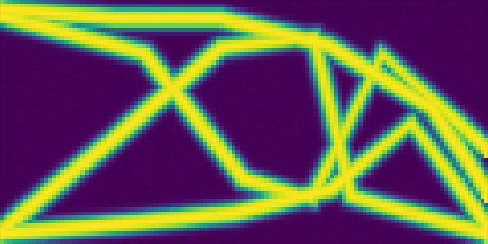
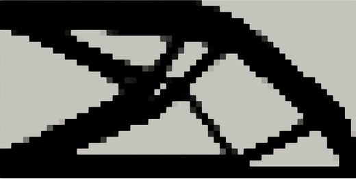

---
# Ensure that this title is the same as the one in `myst.yml`
title: Pipeline-level differentiable programming for the real world
abstract: |
  Automatic differentiation is increasingly being adopted beyond machine learning to tackle optimization problems in various scientific and engineering contexts. These methods have catalyzed the development of differentiable simulators, solvers, 3D renderers, and other powerful components, under the umbrella of differentiable programming. However, building pipelines that propagate gradients effortlessly across components introduces unique challenges. Real-world pipelines often span diverse technologies, frameworks, computing environments, and human skill sets. We argue for the need to support automatic differentiation on a system level to enable further real-world utility of differentiable programming, and ultimately, tangible progress within inverse modeling and design. To that end, we present [Tesseract](https://github.com/pasteurlabs/tesseract-core), a software ecosystem that provides pipeline-level differentiable programming at scale, and demonstrate its utility on a non-trivial [shape optimization case study](optimize.ipynb).
---

## Introduction

Countless problems in science and engineering can be framed as tuning tasks, where parameters of a complex process &mdash; such as a physical simulation or a lab experiment &mdash; are iteratively tuned to maximize an objective. For such tasks, differentiable programming (DP) has emerged as a powerful tool, due to its ability to automate and accelerate gradient-based operations, enabling "differentiable physics" by codifying the use of gradient information to optimize, correct, or control physical systems. At the core of DP is the technique known as automatic differentiation (autodiff, AD) to compute partial derivatives of computer programs without the need to spell out explicit forms of said derivatives. Autodiff techniques enjoy great success in the fields of artificial intelligence and machine learning (ML) thanks to proliferation of deep learning software frameworks such as Autograd, TensorFlow, JAX, and PyTorch [@baydin2018automatic]. However, applications of AD in differentiable physics are largely untested at industrial scale, and ML frameworks are rarely designed for, nor tested on, practical science and engineering _systems_ (as opposed to single components).

We propose "Differentiable Physics Programming" (DPP), a system engineering approach to AD-driven, simulation-heavy pipelines, including but not limited to workflows within computational fluid dynamics (CFD) and computer-aided engineering (CAE). DPP composes heterogeneous, end-to-end differentiable pipelines from components such as physics simulations, differentiable meshers, solvers, and learned models. As such, DPP is a sub-field of Simulation Intelligence (SI) [@lavin2022simulationintelligence], where motifs from numerical simulation, scientific computing, and machine learning are combined to unlock fundamentally new possibilities for design and discovery in science and engineering.

To demonstrate DPP in action we leverage Tesseract, a software ecosystem that enables pipeline-level AD at real-world scale [@Haefner2025]. Tesseract resolves the above challenges via universal, autodiff-native software interfaces, containerization, and dataflow-based orchestration, built to be highly modular and interoperable with physics simulation tools and engineering data types. This allows scientists and engineers of diverse backgrounds to build complex workflows centered around simulation and data-driven surrogate models and propagate gradients throughout entire workflows, thus unleashing the potential of AD on end-to-end applications.

We give an overview of Tesseract's software design and functionality, and demonstrate its utility on a non-trivial problem, showcasing the minimization of compliance of a parametric structure made of a linear elastic material through a physical solver. Our aim in developing Tesseract is to present the community with the tools necessary to realize the potential of DPP broadly, and to build the community that drives the development of said workflows.

## The state of pipeline-level differentiable programming

Real-world pipelines often span diverse technologies, frameworks, computing environments (local vs. distributed clusters; CPU vs. GPU), and teams with varying expertise. Additionally, legacy systems and non-differentiable components often need to coexist with modern AD-enabled frameworks. This provides a unique set of challenges for building and maintaining differentiable pipelines fit for real-world applications.

To the best of our knowledge, modern scientific computing tools do not provide native support for service-level AD, limiting all autodiff processing to a single compute context or hand-implemented remote procedure calls, e.g. via an AD-native framework (such as JAX, TensorFlow, PyTorch, Julia) and a service layer that exposes gradient-specific endpoints. Crucially, there are no standardized gradient APIs on the level of REST/gRPC protocols, so all of these solutions for service-level AD require large efforts to define AD-relevant endpoints, input and output schemas, and glue code. Additionally, it is necessary to factor in orchestration of distributed gradient calculation jobs and workflows. 

This severely constrains the ability for researchers to realize the potential of DPP, which is demonstrated in applications like NeuralGCM [@kochkov2024] and solver-in-the-loop approaches [@um2021solverintheloop]. These early applications, while powerful, are typically confined to 2 independent components, and coupled in an ad hoc way[^footnote-adhoc]. Better tooling and standardized interfaces are needed to enable the community to build complex, multi-step pipelines that can be easily shared and reused.

We are not the first to recognise this gap, and there are several examples in academic literature for solutions to distributed AD. @baker2021peering proposes a technique for distributed training of deep neural networks that leverages
the outer-product structure of the gradient of a network layer. @rush2024federated adopted AD to the context of federated learning of ML models. @tang2023auto considered the problem of differentiating computations expressed in relational databases. Nevertheless, even experimental support for pipeline-level AD is nascent, and it is remarkable that recent surveys on the state of AD do not consider it being an important research direction (@van2018automatic, @baydin2018automatic).

## Tesseracts enable differentiable physics programming at scale

### What is a Tesseract

Tesseracts are components that allow scientists to expose experimental, research-grade software to the world. They are self-contained, self-documenting, and self-executing, via command line, HTTP, and Python interfaces. They are designed to be easy to create, easy to use, and easy to share, including in a production environment. Crucially, Tesseracts provide built-in support for propagating gradient information at the level of individual components, making it easy to build complex, diverse software pipelines that can be optimized end-to-end.

This functionality is implemented in Tesseract Core, the foundational library for defining and serving autodiff-capable components as containerized services. In its simplest form, every Tesseract is a functional compute unit that has a single entrypoint `apply`, which wraps a software functionality of the user’s choice. Other API functions of a Tesseract relate to the operation implemented in `apply`, for example `input_schema` returns expected input structure and types, `jacobian` implements a derivative, and so forth. A Tesseract is usually – but not necessarily – built and distributed as a Docker image, which allows it to be run in any environment that supports Docker, including local machines, cloud platforms, and HPC clusters without explicit dependency management. Tesseracts can be run as standalone services, or composed into larger pipelines, which can be orchestrated using a variety of tools, such as Kubernetes, Airflow, or Prefect.

An overview of Tesseract creation process is depicted in @fig:tesseract-create-serve.

:::{figure} tesseract-scipy-1.png
:label: fig:tesseract-create-serve

The process of defining, creating, and serving a Tesseract.
:::

### Scientific pipelines with Tesseract

Since all Tesseracts can be seen as standalone and stateless components that expose a handful of endpoints with fixed schemas, it is trivial to build pipelines connecting multiple Tesseracts, thus creating complex workflows. Multi-step computational workflows are very common across various branches of science. For example, a CAE pipeline might include steps for generating geometry, meshing, simulation, and postprocessing. Data processing pipelines replace error-prone manual workflows with a structured, automated solution, improving reproducibility, quality, scalability, and collaboration.

To support native integration into JAX-based pipelines, we also provide Tesseract-JAX, which wraps Tesseract Core components as JAX-compatible primitives. This allows users to compose, differentiate, and jit-compile[^footnote-jit] pipelines involving Tesseracts using standard JAX transformations like `grad`, `jit` and `vmap`. Crucially, this allows users to auto-differentiate entire pipelines that include Tesseracts with a single call to `jax.grad` (@fig:tesseract-pipeline).

:::{figure} tesseract-scipy-2.png
:label: fig:tesseract-pipeline

The process of defining multi-tesseract pipelines with Tesseract-JAX.
:::

Several demonstrations of such pipelines already exist in Tesseract ecosystem:

- **[4D-Variational data assimilation for a chaotic dynamical system](https://github.com/pasteurlabs/tesseract-core/blob/7106bf39ae1e07f092e821741aea2b6a02a6d4f4/demo/data-assimilation-4dvar/demo.ipynb).** Using Tesseract Core, we hand-implement a data assimilation pipeline for a chaotic dynamical system. It exploits auto-differentiation capabilities of JAX to backpropagate gradients through the data generating process for efficient solution of the 4D-Variational problem.

- **[Gradient-based optimization of a differentiable CFD simulation](https://github.com/pasteurlabs/tesseract-jax/blob/a2f5a91e7d6f0381723dc99a47f5f08d3e76475b/examples/cfd/demo.ipynb).** Uses Tesseract-JAX to automatically register Tesseracts as JAX-compatible functions, and performs optimization over them through a computational fluid dynamics (CFD) simulation.

While illustrative, these examples are relatively simple and only contain a single Tesseract that is being differentiated in an optimization context. In practice, scientific pipelines are often more complex, involving multiple Tesseracts that need to be composed together and differentiated end-to-end. This is where Tesseract shines, as it allows users to build complex workflows that can be easily shared and reused.

### Case study: Parametric shape optimization with differentiable FEM simulation

👉 See [supplementary notebook](optimize.ipynb) for full case study 👈

We present a concrete demonstration for how the Tesseract ecosystem enables differentiable physics programing, in the form of a novel case study showcasing parametric end-to-end shape optimization of a geometric model with respect to its physical properties.

The pipeline consists of several steps:

1. **Assemble**: construct a parametric geometry using a standard 3D geometry library.
2. **Discretize**: compute an SDF (signed distance field) on a fixed grid.
3. **Transform**: apply a sigmoid function to transform the SDF into a density field.
4. **Solve**: compute the compliance of the design via a finite element solver.

In this pipeline, steps (1)+(2) and (4) are implemented as Tesseract and containerized, while step (3) is implemented as a standard JAX function (@fig:illustration). 

:::{figure} illustration.png
:label: fig:illustration

Data flow through a Tesseract-based pipeline for parametric shape optimization. Involves two separate Tesseracts: one for computing a signed distance field (SDF) from a parametric geometry, and another for computing the compliance of a structure given a density field via finite element analysis.
In the picture, the plots display the intermediate results and gradients which are passed between components, and the boxes with a Python or Tesseract logo represent the actual components that are implemented in Python or as a Tesseract in this demo. The primal evaluation, with solid green lines, is executed first, left-to-right, after which the backward pass, in dotted green lines, calculates the gradient of the the loss function with respect to the pipeline's input parameters.
:::

Since the mapping from design parameters to SDF is done through an industry-standard geometric processing library (PyVista), it is not natively auto-differentiable. Therefore, we implement a custom Tesseract endpoint computing a vector-Jacobian product using finite differences. We then leverage Tesseract-JAX to assemble the full processing pipeline, and use the standard gradient computation function `jax.grad` to compute the total derivative of the objective (compliance) with respect to the design parameters. This allows us to apply gradient-based optimization methods to the design parameters, such as gradient descent or Adam.

We compare our solution with the free form topology optimization solution that is implemented in the jax-fem library [@xue2023jax]. We observe that our solution yields a structure that is strikingly similar to the free form topology optimization solution, even though in our case the design space is parametrized by a small number of parameters, and not solving an unconstrained topology optimization problem.

| Parametric Optimization (Ours) | Free Form Topology Optimization (jax-fem example) |
|-------------------------|---------------------------------|
|  |          |

Despite being a synthetic example, this has line-of-sight to many important real-world applications, such as shape optimization of mechanical structures parametrized by a CAD model, or optimization of fluid flow through a complex geometry. Tesseract pipelines allow us to swap out toy components with real-world implementations, while keeping the overall structure of the pipeline intact.

### Unique value-add

In a world without Tesseract, the above would be significantly more difficult for several reasons.

**Heterogeneity of gradient computation.** In this pipeline some components rely on automatic differentiation, while others rely on finite differences. With Tesseracts, each component is free to implement its own gradient computation strategy, and the pipeline can be composed without knowledge about the details of each component.

**Modularity.** The components of the pipeline are implemented as Tesseract components, which allows us to easily swap out components and reuse them in other pipelines. For example, we could replace the design space Tesseract relying on PyVista with one relying on OpenSCAD, or other commercial CAD software. This is evidenced in the compact representation of the pipeline in @fig:tesseract-pipeline, which directly maps to the logical steps of the implemented process (*assemble-discretize-transform-solve* above).

**Dependency management.** Tesseract components are containerized, which allows us to easily manage dependencies and ensure that the pipeline runs in a consistent environment, which greatly simplifies working with heavyweight scientific software like numerical solvers or graphics processing libraries.

**Computing resources.** Tesseract components can be run on different computing resources, which allows us to easily scale the pipeline and run it on different machines. For example, we are able to run the finite element solver on a GPU machine and the design space Tesseract on a separate CPU node to make the most of available resources.

## Related work

Tesseracts offer a combination of containerised runtime for scientific computing and native AD capabilities. Considered separately, both these areas are rich with existing tools and frameworks.

**Containerised runtime.** There are several projects that provide containerisedruntime infrastructure for scientific computations. Some, including MLServer [@MLServer], BentoML [@BentoML], or Triton Inference Server [@Triton_Inference_Server], target primarily machine learning workloads. Other projects, such as UM-Bridge [@UMBridge] or Singularity [@kurtzer2017singularity], cover a broader scope of scientific domains. A key feature that separates Tesseract ecosystem from these project is its strong focus on gradient computation, and batteries-included approach to the entire SI component lifecycle.

**Automatic differentiation.** Deep learning frameworks like PyTorch [@paszke2017automatic] and TensorFlow [@abadi2016tensorflow] implement AD and leverage it extensively for training of ML models. AD is also one of the main features of JAX, a Python library for high performance numerical computing [@jax2018github], and JAX primitives strongly influenced the design of Tesseract's API. However, these frameworks support AD on a program level, which assumes that the entire program is locally available and traceable. While composite solutions are possible (e.g. combining an AD-capable backend with an HTTP service), there is no native support for distributed AD.

To the best of our knowledge, Tesseract is the first software project that combines these two areas as first-class citizens, and provides a comprehensive solution for building and deploying differentiable scientific computing pipelines.

## Future work

The Tesseract ecosystem already supports a wide range of scientific and engineering workflows. However, not all envisioned use cases are sufficiently supported with tooling, validation, demonstration, and documentation. Ongoing work emphasizes several key directions to improve Tesseract's applicability and usability in real-world scenarios.

**Distributed and cloud-native automatic differentiation.** That is, gradient-based workflows that span multiple machines and heterogeneous environments, including HPC clusters and cloud platforms. This involves enabling remote gradient execution, efficient recomputation strategies, and distributed pipeline orchestration.

**Cross-framework integration.** Many scientific pipelines today mix components from different programming ecosystems. Tesseracts enable end-to-end gradient propagation across JAX, PyTorch, Julia, and other tools—treating them as composable, AD-aware Tesseract components.

**Wrapping simulations behind unified, differentiable interfaces.** Similar to frameworks like OpenAI Gymnasium, Tesseracts can serve as wrappers for expensive simulations—e.g., CFD solvers, structural mechanics codes—that expose unified APIs along with gradient endpoints. This makes it easy to use classical simulation software within differentiable optimization or reinforcement learning pipelines.

**Interoperability in CAE and beyond.** Many domain-specific tools in CAE are poorly integrated with AD tooling. Tesseracts are a natural fit to provide robust support for meshing, geometry processing, and legacy formats in differentiable workflows, allowing users to plug in existing CAE pipelines without compromising engineering efficiency.

**Pipeline-level DPP for real-world applications.** Ultimately, Tesseract aims to demonstrate the real-world viability of DPP across full scientific workflows. This includes hybrid pipelines that blend simulation and machine learning (e.g., surrogate modeling, control, inverse design), and stress-testing DPP tooling under realistic constraints.

## Conclusions

The Tesseract ecosystem is born out of realization that modern autodiff tooling is limited in its scaling capabilities. Tesseracts demonstrate how this gap can be addressed by elevating the concept of derivative computation to the systems level. 

In particular, the focus on composing modular components into end-to-end differentiable pipelines addresses a critical barrier in real-world scientific computing, where workflows often span multiple communities, frameworks, and computational environments. By containerizing components and standardizing interfaces, Tesseracts bridge the gap between specialized tools, legacy systems, research-grade software, and modern AD engines.

## Further reading

- [Tesseract documentation](https://docs.pasteurlabs.ai/projects/tesseract-core/latest/).
- [Tesseract Core](https://github.com/pasteurlabs/tesseract-core) repository on GitHub. 
- [Tesseract Community Forum](https://si-tesseract.discourse.group/); in particular, the [showcase section](https://si-tesseract.discourse.group/c/showcase/11).

[^footnote-adhoc]: The solver-in-the-loop code is pure python, see an example pipeline [here](https://github.com/tum-pbs/Solver-in-the-Loop/blob/f514fcf53c5c955677fb9cbe24c3a17606eef5eb/karman-2d/karman_apply.py#L139); components cannot be reused without knowledge over the specific details of their interface and installing all dependencies locally. NeuralGCM instead ships two separate components: the dynamical core of their physical simulation [Dinosaur](https://github.com/neuralgcm/dinosaur) and the learned parts [PressureLevelModel](https://github.com/neuralgcm/neuralgcm/blob/df10438b41e38c41f7e34ba13dc698c699585ad2/neuralgcm/legacy/api.py#L176), both written in JAX.

[^footnote-jit]: In this context, with "jittable" we imply that JAX does not throw errors when Tesseracts are wrapped with `jax.jit`, although no actual compilation of internal Tesseract code is happening. This is still useful, as it allows users to mix and match Tesseract computations with JAX code in the same functional block. Inner components of Tesseracts may be JIT compiled separately if using JAX internally.