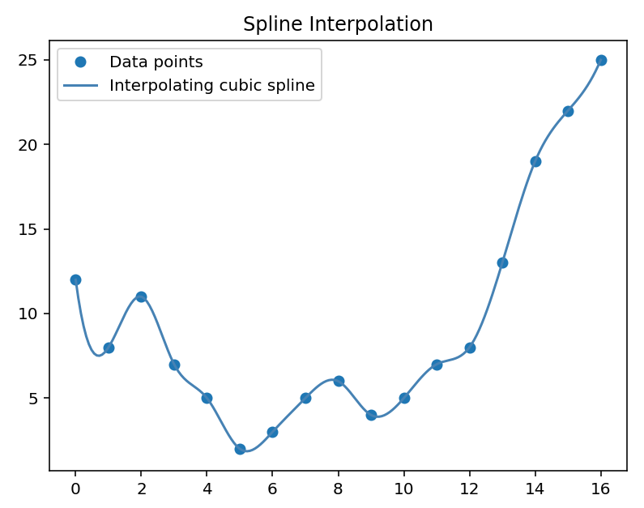
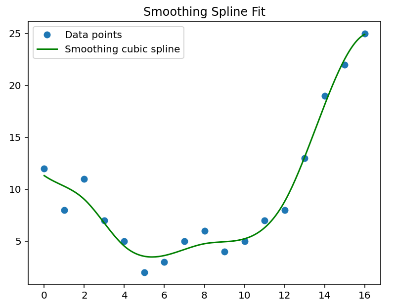
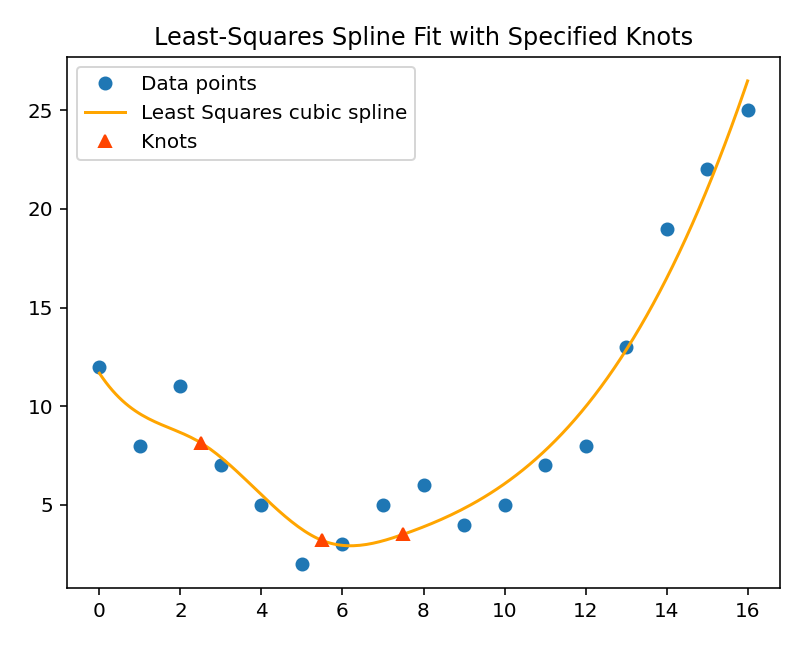
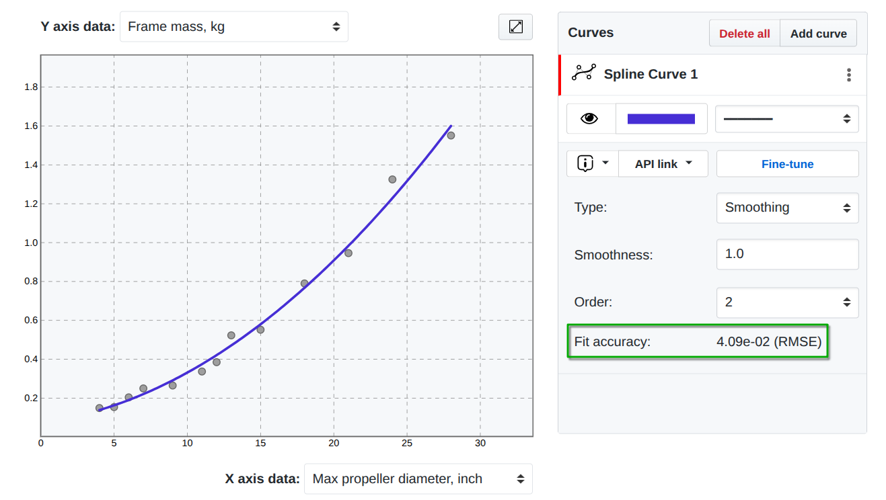
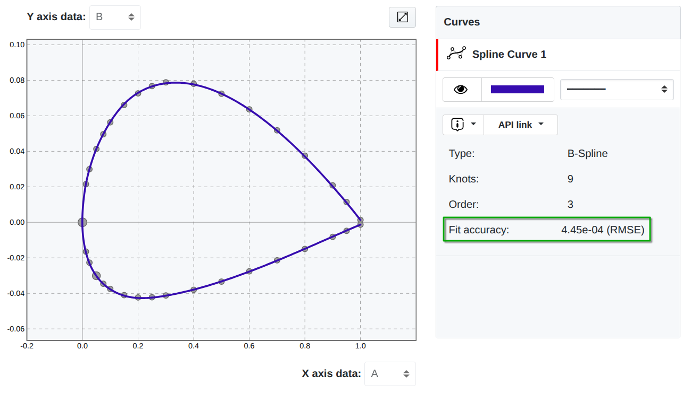
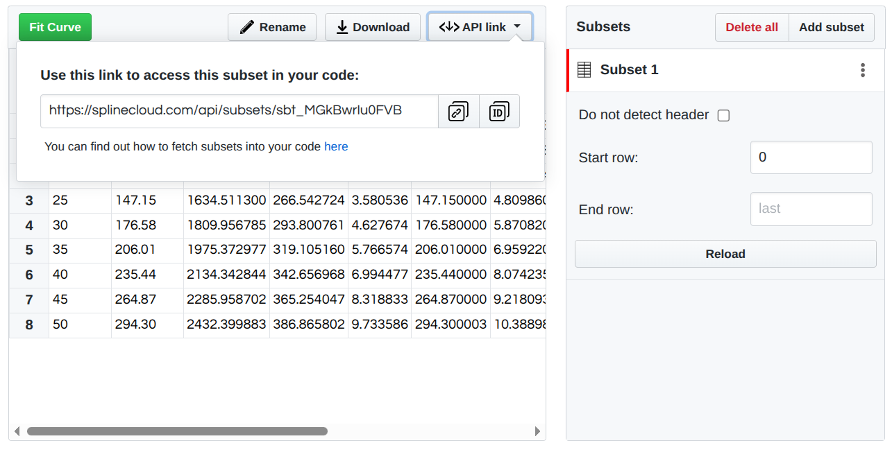
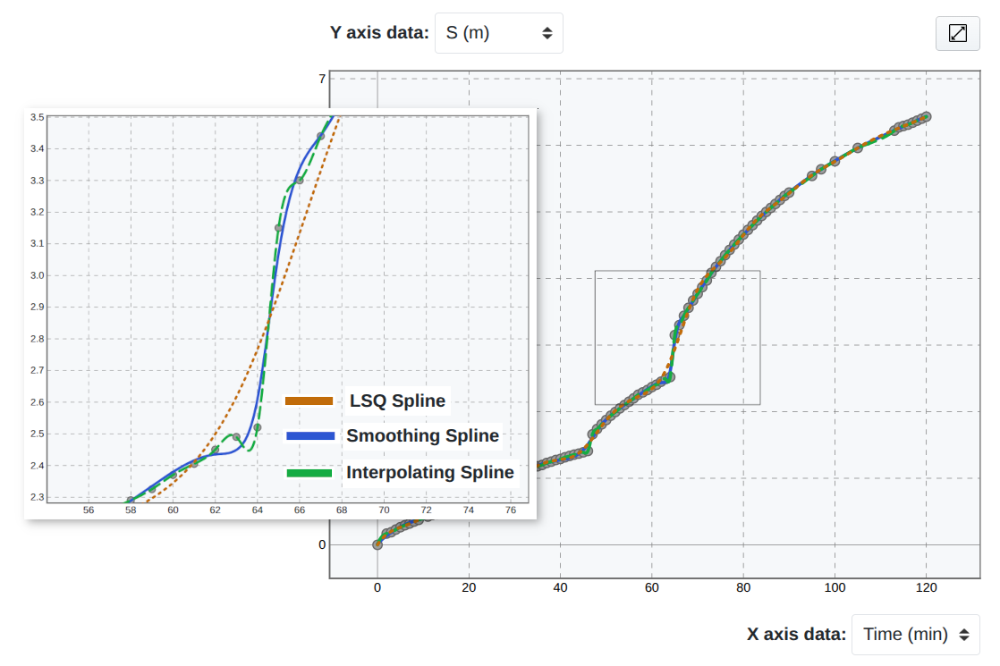
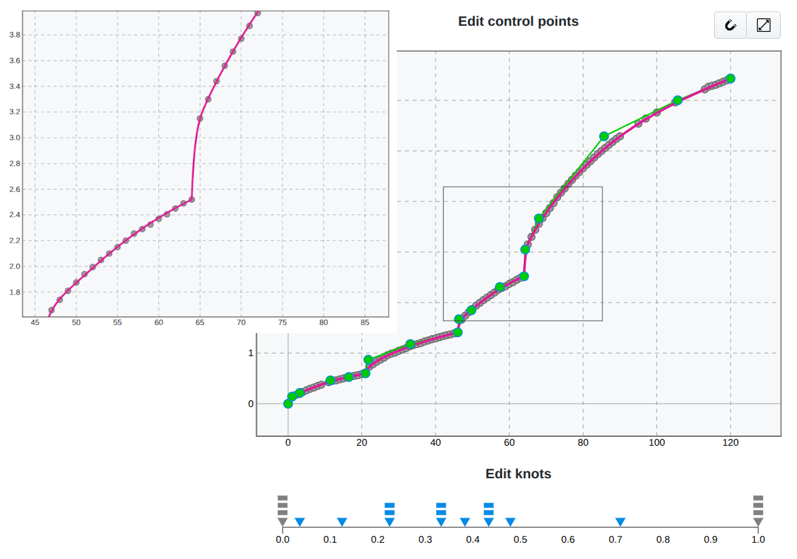
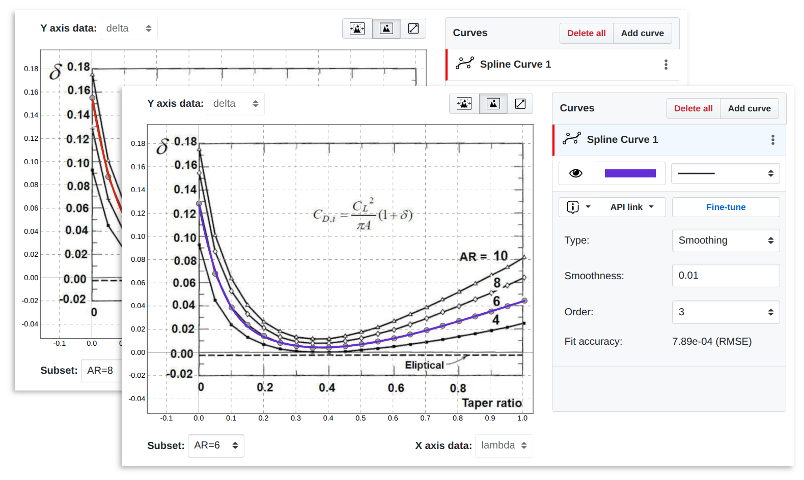
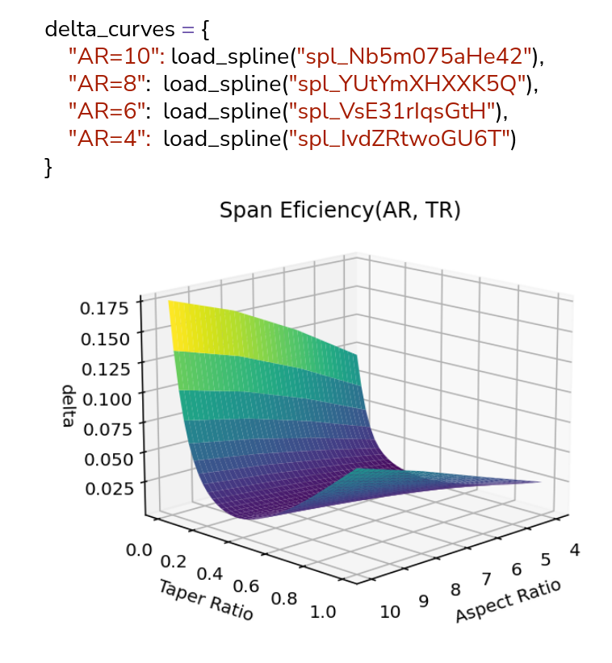

---
# Ensure that this title is the same as the one in `myst.yml`
title: "Enhancing Curve Fitting with SciPy: Interactive Spline Modeling and Reproducibility with SplineCloud"
short_title: 'Enhancing Curve Fitting with SciPy: SplineCloud'
abstract: |
  Curve fitting is a fundamental task in data science, engineering, and scientific computing, enabling researchers to extract meaningful relationships from data. However, selecting and tuning the right fitting model for complex, noisy, or multidimensional data remains a significant challenge. SciPy plays a critical role in addressing these challenges by providing robust spline fitting methods that offer flexibility and precision. Yet, fine-tuning spline parameters, ensuring stability in extrapolation, and sharing fitted models for reproducibility remain open problems.
  
  In order to address these challenges, we developed [SplineCloud](https://splinecloud.com/) - an open platform that provides interactive spline fitting capabilities and uses SciPy on the backend. SplineCloud allows the construction, analysis, and exchange of spline-based regression models using SciPy’s `interpolate` module. SplineCloud’s [curve fitting tool](https://splinecloud.com/features/curve-fitting/) extends the capabilities of SciPy spline fitting methods by enabling researchers to fine-tune spline parameters: knot vector, control points, and degree interactively, and providing the ability to quickly analyze the accuracy of the models. Models constructed on the platform obtain their unique identifiers and become reusable in code, fostering better collaboration and knowledge transfer. Reusability of spline curves and underlying datasets in code is enabled via the open-source SplineCloud client library called `splinecloud-scipy`, which is also based on SciPy. The proposed approach of interactive cloud-based fitting improves data processing workflows, allows separating data preparation and approximation routines from the main code, and brings FAIR principles to the curve fitting, enabling researchers to construct and share libraries of empirical data relations.
---

## Introduction

The adoption of FAIR data principles [@doi:10.1038/sdata.2016.18] has fundamentally transformed research practices across scientific disciplines. Initially designed to enhance research data management and increase transparency, these principles now extend to a broad range of digital scientific artifacts, including computational models, source code, 3D models, and other digital objects. Widespread adoption of FAIR principles fosters improved reproducibility and facilitates the integration and extension of scientific results. However, not all digital objects achieve the same level of FAIRness, and many platforms lack support for the diverse range of data formats and objects used in science and engineering.

This paper focuses on enhancing reusability — and thereby reproducibility — in the context of regression modeling, a technique used to mathematically describe the relationship between dependent and independent variables. This process, commonly known as curve fitting, is widely employed in data science, engineering, and scientific computing, particularly for processing experimental data and extracting interpretable models for further analysis. Of particular practical interest is spline fitting, which effectively models complex empirical relationships without explicit underlying mathematical laws. A formal overview of splines and spline fitting is provided in {ref}`some-theoretical-background-behind-splines` and {ref}`spline-fitting-with-scipy`.

SciPy’s `interpolate` module offers extensive functionality for constructing splines, from simple interpolating curves to advanced smoothing splines and parametric representations. Its spline fitting methods provide robust algorithms widely used to model complex, noisy, or multidimensional data dependencies. Nonetheless, the capabilities of splines cannot be fully leveraged through purely programmatic interfaces. In contrast, modern graphical modeling software with interactive spline manipulation affords a level of control and intuitive adjustment not achievable by traditional automatic fitting methods. This, together with a problem of reusability of obtained models, their accessibility, and interoperability, leaves a way for thorough considerations towards alternative approaches to the curve fitting process. 

These considerations eventually led to the development of a dedicated platform for interactive spline fitting, which incorporates FAIR principles and adapts them to the regression models. Built upon SciPy’s routines, SplineCloud enables collaborative, transparent, and reusable curve fitting [^footnote-1]. Sections 4 through 8 of this paper detail the similarities and distinctions between SciPy’s and SplineCloud’s approaches, illustrating a novel paradigm for collaborative data fitting.

[^footnote-1]: First described in [Mastering Curve Fitting. How to Fit Complex Data with Parametric Splines](https://splinecloud.com/blog/mastering-curve-fitting-how-to-fit-complex-data-with-parametric-splines/)

(some-theoretical-background-behind-splines)=
## Some Theoretical Background Behind Splines

Splines are piecewise-defined functions used extensively in numerical analysis, computer-aided geometric design, and data fitting. The fundamental idea behind the spline fitting process is to construct a smooth function that matches a set of data points or satisfies a set of constraints, while preserving computational efficiency and numerical stability. Splines can be represented in several forms, each suitable for different applications: Piecewise Polynomial, Hermite, Bézier, B-spline, NURBS (Non-Uniform Rational B-Splines). Amongst these forms, a special place takes B-Spline representation - where the spline function (or curve) is expressed as a linear combination of basis functions.

A distinction must be made between spline functions and parametric spline curves:

- **A spline function** is a scalar-valued function $S(x)$, defined over a single independent variable $x$, typically used in interpolation or regression of scalar data.

- **A parametric spline curve** defines a vector-valued mapping from a scalar parameter $t$ to a multidimensional space:

```{math}
\mathbf{C}(t) = \left( x(t), y(t), z(t), \dots \right)

```
where each coordinate function $x(t), y(t), \dots$ is a spline function in $t$. This is the common representation in geometric modeling and computer graphics.

A particularly efficient and widely used spline representation is the B-spline (basis spline). B-splines are defined via a set of control points ${ \mathbf{P}_i }$ and a knot vector ${ t_i }$, and provide local control, numerical stability, and efficient evaluation. A B-spline curve of degree $k$ is defined as:

```{math}
:label: b-spline
\mathbf{C}(t) = \sum_{i=0}^{n} \mathbf{P}_i B_{i,k}(t)
```
where $\mathbf{P}_i$ are control points, $B_{i,k}(t)$ are the B-spline basis functions of degree $k$, defined recursively by the Cox–de Boor formula [@doi:10.1093/imamat/10.2.134; @de-boor]:

```{math}
B_{i,0}(t) =
\begin{cases}
1, & \text{if } t_i \leq t < t_{i+1} \\
0, & \text{otherwise}
\end{cases}
```

```{math}
:label: cox-de-boor
B_{i,k}(t) =
\frac{t - t_i}{t_{i+k} - t_i} B_{i,k-1}(t)
+
\frac{t_{i+k+1} - t}{t_{i+k+1} - t_{i+1}} B_{i+1,k-1}(t)
```

In {ref}`cox-de-boor` possible divisions by zero are resolved by the convention that ‘anything divided by zero is zero’ [@lyche-morken]. This formulation separates geometry (control points) from basis functions, allowing flexible manipulation and efficient computation of spline curves.

Parametric splines are widely used in computer graphics, computer-aided design (CAD), and more general geometric modeling, where the goal is to design and manipulate accurate and smooth curves and surfaces in two or three dimensions. Their unique properties allow for high shape flexibility, local control over curve shape and its continuity. An intuitive visual explanation of splines, different forms of their representation and unique properties is given in the video by Freya Holmér [@holmer-continuity-of-splines].

However, despite their geometric advantages, parametric splines are rarely used in statistical data fitting and regression analysis. The primary limitation is the parameterization problem: for observed data points $(x_i, y_i)$, there is no universally optimal method to assign parameter values $t_i$ that correspond meaningfully to the underlying data relationship. While heuristic approaches such as chord-length or centripetal parameterization are commonly used, the choice can significantly influence the quality of the resulting fit [@lee-parametric-fitting]. Additionally, parametric splines do not provide the direct functional relationship $y = f(x)$ that is typically required for prediction and statistical inference in data analysis contexts. This is why spline functions are often a more popular choice. 

(spline-fitting-with-scipy)=
## Spline Fitting With SciPy

SciPy provides a robust and flexible set of spline fitting tools for both **interpolation** and **approximation** through the `scipy.interpolate` module.
In terms of univariate fitting, SciPy supports several spline fitting methods, including:

**Interpolating splines** ({ref}`fig:scipy-spline-fitting` a) - exact fit to the data. This constructs a spline $S(x)$ such that:

```{math}
S(x_i) = y_i \quad \text{for all } i
```
and ensures continuity of first and second derivatives ($C^2$ continuity for cubic splines).

**Smoothing splines** ({ref}`fig:scipy-spline-fitting` b) - approximate fit with smoothness penalty. The smoothing spline minimizes the penalized least-squares objective:

```{math}
\min_S \left\{ \sum_{i=1}^n \left( y_i - S(x_i) \right)^2 + \lambda \int_a^b \left( S''(x) \right)^2 dx \right\}
```
where $\lambda$ is a regularization parameter related to s.

**Least squares splines** ({ref}`fig:scipy-spline-fitting` c) - approximate fit with squared residual minimization penalty:

```{math}
\min_S \sum_{i=1}^n \left( y_i - S(x_i) \right)^2
```

**Parametric splines**. Used to fit looped curve, isolines, or 3D curves.

:::{figure}
:label: fig:scipy-spline-fitting
Spline fitting results with a use of SciPy's `interpolate` methods.
<table>
<tr>
<td style="text-align: center;">(a) Simple interpolating cubic spline.</td>
<td style="text-align: center;">(b) Smoothing cubic spline.</td>
<td style="text-align: center;">(c) Least-Squares cubic spline.</td>
</tr>
</table>
:::

### Pain Points of Pure Programmable Spline Fitting

SciPy provides a programmatic interface to robust spline fitting methods suitable for a variety of tasks, particularly when working with complex experimental or statistical data. However, despite offering multiple fitting methods and adjustable parameters, selecting an appropriate combination can be challenging. As noted by [@pasko-blog-post-2015], issues such as overfitting and extrapolation control lack straightforward solutions and often require multiple iterations, either with visual inspection or advanced scripting.

The mathematical formulation of B-splines—especially parametric B-splines and NURBS—enables fine control over curve shapes through manipulation of control points and knot vectors. While this functionality is widely leveraged in computer graphics and CAD applications, it is not supported in SciPy.

Introducing interactive control over curve geometry can improve fitting accuracy and reduce the time spent tuning parameters in search of acceptable results from automatic fitting routines.

Another limitation is the lack of portability and reproducibility of fitted models. SciPy spline objects are tightly coupled to the Python runtime and local environment. Although spline parameters (order, knot vector, and coefficients) can be exported, reconstructing models from these components requires an understanding of B-spline structure. Model serialization is also possible, but may not be practical in all scenarios.

These limitations hinder reproducibility and lead to duplicated effort, where researchers repeatedly perform the same fitting procedures on shared datasets, reimplementing logic and parameters independently. Even when code and data are shared, fitted models often remain environment-specific and are difficult to reuse across projects.

Overcoming these challenges requires workflows in which spline models can be edited interactively, stored independently from source code and raw data, and reused across tools and teams.

These needs motivated the development of SplineCloud, a platform that extends SciPy’s spline fitting with interactivity, transparency, and full model lifecycle support.


## Introducing SplineCloud

SplineCloud is an open platform for formalized knowledge exchange. It is designed to make technical data, like results of simulations, tests and modeling, more accessible and reusable in computer code. Its architecture and instruments help reduce the routine overhead of data collection, processing, and model reconstruction in code.

SplineCloud is free to use for everyone, publishing open data, however, its source code is closed (as of now). Repositories with limited access are a part of the platform's monetization model. All tools are free to use without limitations (except repository size, which as of now is limited to 3 GB). The platform's main features are: plot digitizer, advanced spline fitting tool, open API, and client libraries for Python and MATLAB (libraries for other languages are planned for future implementation).

The philosophy behind the platform is in representing data relations in the form of spline models, which can be reused in code. In this way, SplineCloud can be considered as a repository-based open library of functional relations. The typical user journey on the platform is given in {ref}`fig:workflow_scheme`.

:::{figure} figures/workflow_scheme.png
:label: fig:workflow_scheme
:width: 400px
SplineCloud workflow scheme: upload data to repository, define datasets, create data relations using spline fitting tool, share and access curves and datasets in code via API.
:::

The platform’s data structure is given in {ref}`fig:class_diagram`. Each repository may contain multiple data files (uploaded by authors), which serve as sources for datasets; authors and other users can define subsets (clean data) related to datasets. Subsets are used for the construction of data relations, which capture relationships between columns in subsets. Parametric spline curves are used to model these relations.

:::{figure} figures/class_diagram.png
:label: fig:class_diagram
SplineCloud objects relationship diagram
:::

Spline fitting tool, a main instrument of the platform, is built on top of SciPy’s interpolate module and provides a visual interface to three main spline fitting methods described in {ref}`interactive-spline-fitting-workflow`: Interpolating Splines, Smoothing Splines, Least Squares Splines.

The web interface of the spline fitting tool is powered by [D3.js](https://d3js.org/) and JavaScript build of [verb-nurbs](https://github.com/pboyer/verb) - an open-source library for NURBS modeling. The RESTful API and an open-source Python client library ([splinecloud-scipy](https://github.com/nomad-vagabond/splinecloud-scipy)) allow the reuse of data objects and spline curves in code. In this way, SplineCloud addresses the key limitations of traditional spline fitting workflows by offering the following core capabilities:

 - Interactive Spline Modeling;
 - Reusability and Interoperability of Models;
 - Model Traceability.

(interactive-spline-fitting-workflow)=
## Interactive Spline Fitting Workflow

Interactivity in the curve fitting process significantly simplifies and accelerates model construction. It enables users to identify overfitting, discontinuities, or extrapolation issues early, and make real-time adjustments. This is especially valuable in parametric spline fitting, where fine-tuning the curve shape and knot configuration often requires iterative, visual feedback. In this section, we will take a look at how these capabilities are implemented in SplineCloud and how the interactive curve fitting approach can be complementary to the programmatic data processing workflows.

### Data Preparation

According to the workflow presented in {ref}`fig:workflow_scheme`, data has to be uploaded to the existing or new repository. It can be a text file, a spreadsheet, or an image containing a plot. In a case of text data, a default dataset will be created automatically and a subset of data can be identified by adjusting data loading options. Datasets will be created automatically for each sheet in the spreadsheet source file. An interactive plot digitizer tool will be displayed for the image file to help extract data ranges from plots ({ref}`fig:splinecloud_datasets`).

:::{figure} figures/splinecloud_datasets.png
:width: 650px
:label: fig:splinecloud_datasets
SplineCloud datasets extracted from the tabular data file and plots
:::

After identifying clean subsets, a default Data Relation object will be created after entering a curve fitting mode (either by clicking the Fit Curve button or going into the Relations tab).

### Automatic Spline Fitting

By adding a first curve, an initial spline fit is generated using a smoothing splines method ({ref}`fig:splinecloud-curve-fitting`). 

:::{figure} figures/splinecloud-curve-fitting.png
:width: 600px
:label: fig:splinecloud-curve-fitting
Spline fitting tool
:::

SplineCloud’s smoothness parameter is a relative parameter used to calculate SciPy’s (FITPACK’s) smoothing factor $s$ defined as:

```{math}
\sum_{i=1}^{n} w_i \left( y_i - S(x_i) \right)^2 \leq s
```

The transition from the relative smoothing parameter to SciPy’s s-factor is implemented in three steps:
1) building the least squares fit with the minimal possible number of knots (zero internal knots);
2) calculating the actual smoothing factor $s_{max}$ for this fit using formula (8);
3) multiplying the relative smoothing parameter by this value: $s_{\text{scipy}} = s_{\text{max}} \cdot s_{\text{rel}}$

This approach improves user experience - instead of guessing each time the correct absolute value (which depends on the scale of data points), it is more intuitive to use relative values. By selecting several values for one data range the developed feedback instructs the more appropriate values for another curve of a different scale.

Least Squares fitting is implemented as an alternative to smoothing splines and is built on top of SciPy’s `LSQUnivariateSpline` class. For simplicity, a uniform knot vector is constructed and passed to the class constructor using the number of internal knots from the user input. However, there is an option to adjust the knot vector interactively and use least squares fitting for the given non-uniform knot vector. This capability is implemented in the fine-tuning mode (see {ref}`fine-tuning-interactive-adjustments-of-control-points-and-knot-vector`).

SplineCloud also supports interpolating splines, implemented via hardcoded $s=0$ in `UnivariateSpline` class constructor.

(fine-tuning-interactive-adjustments-of-control-points-and-knot-vector)=
### Fine-Tuning. Interactive Adjustments of Control Points and Knot Vector

A principal enhancement over the automatic fitting approach is SplineCloud’s Fine-Tuning functionality. It provides the ability to visually adjust control points and knot vectors of fitted splines. As proved in many cases, this interface enables users to achieve curve refinements that exceed the capabilities of SciPy’s automatic fitting algorithms in terms of smoothness and accuracy. Moreover, the visual interface to knot vectors provides control over curve continuity in the specific regions. This helps in modelling complex data behavior with steep changes in main trends.

In SplineCloud, all spline curves are represented as parametric B-splines or NURBS. As mentioned in {ref}`some-theoretical-background-behind-splines`, a parametric B-spline curve is defined as a vector-valued function {ref}`b-spline`. This function, however, can be decomposed into its scalar components:

```{math}
\begin{aligned}

S^{(x)}(t) &= \sum_{i=0}^{n} c_{i}^{(x)} B_{i,k}(t) \\
S^{(y)}(t) &= \sum_{i=0}^{n} c_{i}^{(y)} B_{i,k}(t)
\end{aligned}
```

In simpler words, parametric spline curves can be defined by two distinct univariate spline functions, $x(t)$ and $y(t)$, sharing a common knot vector ({ref}`fig:spline_curve_as_two_functions`). This representation allows for the modeling of complex geometries, including loops, sharp transitions, and high-curvature regions.

:::{figure} figures/spline_curve_as_two_functions.png
:width: 500px
:label: fig:spline_curve_as_two_functions
Parametric spline curve as a combination of two spline functions.  *Black triangles along parameter axes represent knots. Control polygons and control points are displayed in green color*
:::

#### Interactive Editing of Control Points

The beauty of parametric splines is in the ability to have an intuitive control over the curve shape by modifying the control polygon: moving, adding, and removing control points, increasing or decreasing their weights. This is impossible for spline functions, since they are defined through scalar coefficients, not vectors.

However, it is important to mention that for parametric spline curves coordinates of the control points $P_i = [x_i, y_i]$ are mathematically equivalent to the spline coefficients for the component functions $S^{(x)}(t)$ and $S^{(y)}(t)$, so that:

```{math}
\mathbf{C}(t) = \sum_{i=0}^{n} \mathbf{P}_i \, B_{i,k}(t), \quad \text{where } \mathbf{P}_i = \begin{bmatrix} c_i^{(x)} \\ c_i^{(y)} \end{bmatrix}
```

Due to the local support property of B-spline basis functions, moving a single control point influences the shape of the curve only within a limited range of the parameter domain, providing localized editing capabilities.

In the Fine-Tune mode, users can interactively drag control points to reshape the curve ({ref}`fig:fine-tune-control-points`). This mirrors the behavior of spline modeling in professional CAD environments, where designers sculpt geometry directly. The influence of each control point depends not only on its position but also on the associated basis function and, optionally, its weight. Assigning higher weights to a control point increases its pull on the curve, bringing it closer to the point's location, converting the B-Spline to NURBS.

:::{figure} figures/fine-tune-control-points.png
:width: 600px
:label: fig:fine-tune-control-points
Adjusting control points of the spline curve in the Fine-Tune mode
:::

This form of user interaction provides precise control over the spline's shape and is particularly advantageous when fitting complex datasets where automated routines produce unsatisfactory results.

#### Dynamic Knot Vector Adjustment

The knot vector plays a central role in determining the structure and properties of the resulting spline curve. Given a spline of degree k, the knot vector $\{ t_0, t_1, \ldots, t_{m} \}$ is a non-decreasing sequence of real numbers, typically ranging from 0 to 1 (but not necessarily). Each interval $[t_i, t_{i+k+1})$ corresponds to a region over which a particular B-spline basis function $B_{i,k}(t)$ has support, meaning that each basis function is non-zero over at most $k+1$ knot spans. The location and multiplicity of knots affect several critical properties of the resulting spline:

- **Continuity**. The number of continuous derivatives at a knot $t_i$ is $k−m_i$​, where $m_i$ is the multiplicity of that knot. Repeated knots reduce the smoothness of the spline at that knot location. Specifically, if a knot has multiplicity $m$, then the continuity of the spline at that knot is reduced to $C^{k - m}$, where $k$ is the degree of the spline. That is, the spline remains $(k - m)$-times continuously differentiable, and all higher derivatives are discontinuous.

- **Flexibility**. Adding more knots increases the local adaptability of the spline, allowing it to better follow variations in the data. In the B-spline formulation, the number of basis functions, and therefore the number of control points $n$ is always $T−k−1$, where $k$ is the spline degree, $T$ is the number of knots. As more interior knots are introduced, the number of basis functions increases, providing additional degrees of freedom for shaping the curve while maintaining the required continuity.

In traditional fitting methods such as `LSQUnivariateSpline` in SciPy, the knot vector must be either provided manually or generated heuristically, which typically requires some kind of iterative approach in finding an optimal (usually quasi-optimal) knot vector. SplineCloud removes this complexity by exposing the knot vector as an editable structure in the Fine-Tune mode, where users can manipulate knots directly and observe their impact on the spline in real time ({ref}`fig:fine-tuning-knot-vector`).

:::{figure} figures/fine-tuning-knot-vector.png
:width: 600px
:label: fig:fine-tuning-knot-vector
Adjusting the knot vector of the spline curve in the Fine-Tune mode
:::

In particular, SplineCloud enables users to insert and remove knots, relocate internal knots, add and remove duplicate knots to control continuity and introduce geometric features such as cusps, kinks, or plateaus.

Uniformly spaced knot vectors typically produce curves with more predictable and symmetric behavior, which is easier to interpret visually and adjust interactively. In contrast, non-uniform vectors can help in fitting local irregularities with higher precision.

(fitting-errors)=
### Fitting Errors

Comparison of the different fitted models requires a well-defined error metric that quantifies the discrepancy between the predicted and actual data.  Out of many different metrics it is worth to mention the most common: Mean Absolute Error (MAE), Mean Squared Error (MSE), Root Mean Squared Error (RMSE).

```{math}
\text{MAE} = \frac{1}{n} \sum_{i=1}^{n} \left| y_i - S(x_i) \right|
```

```{math}
\text{MSE} = \frac{1}{n} \sum_{i=1}^{n} (y_i - S(x_i))^2
```

```{math}
\text{RMSE} = \sqrt{\frac{1}{n} \sum_{i=1}^{n} (y_i - S(x_i))^2}
```
where $y_i$​ are the actual data values, $S(x_i)$​ are the corresponding predicted values from the curve, $n$ is the total number of data points.


#### Estimating Fitting Errors in SciPy

In SciPy's spline fitting, smoothing splines support weighted data points, with fitting errors estimated using the corresponding weighted residuals. If weights $w_i$​ are provided (or implicitly set to 1), the weighted squared residuals are computed as:

```{math}
R_i = (w_i \left( y_i - S(x_i) \right))^2
```

The smoothing condition is formulated as:

```{math}
\sum_{i=1}^{n} R_i \leq s
```

where $s$ is the smoothing factor. This formulation is used internally by functions such as `UnivariateSpline` and `splrep`, where the goal is to balance curve fidelity with smoothness.

The `UnivariateSpline` class includes a method called `get_residual()`, which returns the weighted sum of squared residuals used in the spline construction process. Here is an example of estimating the fitting error using the built-in `get_residual()` and custom estimator function:


```python
import numpy as np
from scipy.interpolate import UnivariateSpline

# Generate synthetic data
x = np.linspace(0, 10, 100)
y = np.sin(x) + 0.2 * np.random.randn(100)

# Fit smoothing spline
spline = UnivariateSpline(x, y, s=5.0)

# Evaluate spline at input points
y_fit = spline(x)

# RMSE using SciPy's get_residual()
residual = spline.get_residual()
rmse_scipy = np.sqrt(residual / len(x))

# RMSE computed manually
rmse_manual = np.sqrt(np.mean((y - y_fit)**2))

print(f"RMSE (SciPy):  {rmse_scipy:.5f}")
print(f"RMSE (Manual): {rmse_manual:.5f}")
```

```bash
RMSE (SciPy):  0.22361
RMSE (Manual): 0.22361
```

#### Estimating Fitting Errors in SplineCloud

In SplineCloud, the RMSE is calculated automatically for all curves. The `Fit accuracy` hint updates after each curve modification ({ref}`fig:fit_accuracy` a, b). This allows tracking the change of fitting error while applying different fitting parameters, comparing different models and fine-tuned curves against automatically fitted models.

:::{figure}
:label: fig:fit_accuracy
Simple interpolaing cubic spline.
<table>
<tr>
<td style="text-align: center;">(a) RMSE estimation in SplineCloud.</td>
<td style="text-align: center;">(b) RMSE evaluated via shortest distance residuals.</td>
</tr>
</table>
:::

For complex curve shapes, especially those with closed loops ({ref}`fig:fit_accuracy` b), the error between a data point and the curve should not be measured only along the vertical axis. Instead, the true discrepancy is the Euclidean distance from each data point to the nearest point on the curve. This approach is implemented in SplineCloud to estimate fitting errors of parametric curves that approximate data in non-ascending order via $RMSE_{sd}$ - root mean squared shortest distance error:

```{math}
\text{RMSE}_{sd} = \sqrt{ \frac{1}{n} \sum_{i=1}^{n} (w_i d_i)^2 }
```

where $d_i$ is the shortest distance between a data point and the spline curve. Evaluation of this distance is implemented via SciPy's `optimize` module, and particularly a [direct](https://docs.scipy.org/doc/scipy/reference/generated/scipy.optimize.direct.html) method is used as one of the most stable and fastest global optimization algorithms (based on the in-house analyses).


## Reusability and Reproducibility with SplineCloud

Reusability and reproducibility are closely related concepts in scientific research, both essential for ensuring that data-driven results can be reliably verified, extended, and applied across different contexts and by independent researchers.

**Reusability** refers to the capacity of data, models, or computational results to be used beyond their original context, either by the same researcher at a later time or by others pursuing related work.

**Reproducibility** denotes the ability of independent researchers to replicate the results of a study using the same input data, methods, and conditions. In computational science, this typically involves the complete transparency of the modeling pipeline, including data preprocessing, parameter tuning, and evaluation metrics.

In conventional curve fitting workflows implemented via a programmable interface, fitted models are often tightly coupled with the original data and code used to generate them. While the source data and fitting scripts may be published, the resulting models themselves are rarely stored or shared as independently reusable objects. As a result, anyone wishing to replicate or build upon a previous curve fitting problem must re-execute the entire fitting process, including selecting the method, tuning parameters, and validating the fit.

This leads to the following limitations:
 - **Redundant effort**. Researchers across teams or domains often repeat fitting procedures for the same datasets.
 - **Poor reproducibility**. Deviations in fitting parameters and algorithms across various programming environments may cause discrepancies in reproduced models and, as a consequence, discrepancies in modelling results.
 - **Poor interoperability**. There is no widely adopted convention for serializing and sharing regression models across tools and environments. As a result, transferring models typically requires manual extraction of fitting parameters or curve construction data (like spline parameters). This process is error-prone and demands significant additional effort to reuse models accurately in code.

By extending the principles of FAIR data to regression models, it becomes clear that it is not sufficient to publish raw data and code alone - intermediate or final research outputs such as fitted models (or response surface models) should also be accessible in standardized, referenceable form.

### Improving Reusability and Reproducibility of Spline Models

SplineCloud addresses these challenges by decoupling the spline model from the fitting code and treating it as a first-class, shareable object. The platform is open for open data and supports persistent storage of fitted curves as structured entities that include:
 - Unique IDs and web links;
 - API links that return spline data and related datasets and subsets;
 - A metadata layer, including authorship, tags, units, and other associated context (improvements in progress).

Once users create spline models interactively, they become instantly accessible to the broad public, including anonymous users. Reusability and reproducibility are ensured by both the open REST API and client libraries. 

An official Python client, `splinecloud-scipy`, is based on SciPy and allows for fetching spline data using the spline UIDs and recreating the model in code. Reusable spline model has critical methods for evaluating spline in the form $y=f(x),$ loading underlying data, and assessing fit accuracy (using one of the methods, listed in {ref}`fitting-errors`). This enables a new level of interoperability: a spline curve fitted by one researcher can be discovered on the platform, imported and evaluated in another researcher’s codebase, without downloading and importing the original data and refitting it.

Let’s first take a look at the client library basic usage scenarios and then discuss the library structure and how splines are recreated and evaluated. 


#### Python client

`splinecloud-scipy` is a library that can be installed from the Python Package Index:

```bash
pip install splinecloud-scipy
```

As of now, the library provides two main functions: `load_spline()` and `load_subset()`, which should be used to fetch spline models and underlying subsets:

```python
from splinecloud_scipy import load_spline
spline = load_spline(<curve_uid>)
```

The curve UID can be taken from SplineCloud - an API link dropdown on the Curves toolbox ({ref}`fig:api-links` a). `load_spline()` returns an instance of the `ParametricUnivariateSpline` class, which allows for evaluating the spline as a function of $x$. 

```python
import numpy as np
X = np.linspace(0, 20, 100)
Y = spline.eval(X, extrapolate=True)
```

The spline object allows for loading underlying data:

```python
columns, table = spline.load_data()
```

The same result can be achieved by explicitly loading a corresponding subset via its UID. Similarly to the spline curve, the subset UID can be taken from the SplineCloud API dropdowns ({ref}`fig:api-links` b). Both methods return a tuple with a list of column names and a NumPy array with subset data.

```python
from splinecloud_scipy import load_subset
columns, table = load_subset(<subset_uid>)
```

:::{figure}
:label: fig:api-links
Accessing the curve and subset API links.
<table>
<tr>
<td style="text-align: center;">(a) Accessing the curve API link.</td>
<td style="text-align: center;">(b) Accessing the subset API link.</td>
</tr>
</table>
:::

More information on the library usage can be found in the library code [repository](https://github.com/nomad-vagabond/splinecloud-scipy) README section.

The `splinecloud-scipy` library is built around two core classes: `ParametricUnivariateSpline` - for the construction of the parametric splines from the curve data (degree, control points, and knot vector) and `PPolyInvertible` - a helper class defined to enable solving the spline curve as a function of $x$ values. Both classes extend SciPy’s classes, namely: `interpolate.UnivariateSpline` and `interpolate.PPoly`.

`ParametricUnivariateSpline` is the main class of the `splinecloud-scipy` client library. Its instance is returned by the `load_spline()` function. It defines a 2D parametric spline curve based on two univariate spline functions — one for the $x(t)$ and one for the $y(t)$ dependencies, that share a common knot vector and spline degree.

The `ParametricUnivariateSpline` object is callable - it takes a parameter value and returns the corresponding $x$ and $y$ values by calling internal objects `self.spline_x()` and `self.spline_y()` - instances of SciPy’s `UnivariateSpline` class. This part, however, requires refactoring, since it uses private methods to construct `UnivariateSpline` from the knot vector, coefficients, and degree. There is a plan to use the `BSpline` class instead of `UnivariateSpline` here:

```python
 self.spline_x = si.UnivariateSpline._from_tck(tck_x)
 self.spline_y = si.UnivariateSpline._from_tck(tck_y)
```

Evaluation of the spline in the form $y(x)$ is implemented in the `eval()` method. This method creates a piecewise polynomial representation of spline functions x(t) and y(t) using the custom `PPolyInvertible` class. The methods of this helper class allow for finding the interval containing the *x-value*, then the polynomial is solved for the *t-value*. This parameter value is then used in the spline function $y(t)$ to find the desired *y-value*. 

Polynomial representations are constructed inside the private method `_build_ppolyrep()`, called on the `ParametricUnivariateSpline` initialization.

```python
  def _build_ppolyrep(self):
      self.spline_x.ppoly = PPolyInvertible.from_splinefunc(self.spline_x, extrapolate=True)
      self.spline_y.ppoly = PPolyInvertible.from_splinefunc(self.spline_y, extrapolate=True)
```

The `ParametricUnivariateSpline` class also provides a method for evaluating fit accuracy using one of the three methods discussed in {ref}`fitting-errors`.

```python
RMSE = spline.fit_accuracy(table, method="RMSE")
```

The client library introduces basic capabilities that allow for fetching, recreating, and evaluating spline models in code. Its structure, however, is a bit complicated: conversion to polynomial representation may be omitted in future versions, and other approaches may be used to evaluate the inverse relation $t(x)$ or solve the relation $y(x)$ directly. Contribution for this and other improvements is welcome.

Nevertheless, the implemented approach is covered with tests, supports extrapolation, and shows good performance (no reportable benchmarking was performed).

(implications-and-limitations-of-splinecloud)=
### Implications and Limitations of SplineCloud

The interactive, collaborative and reusable curve fitting enabled by SplineCloud minimizes redundant work and enhances the reliability and continuity of model-based research outputs. However, the platform currently does not support other classes of regression models such as polynomial fits, rational functions, exponential models, or machine learning-based regressors. This limitation is not technical in nature but a deliberate, temporary design decision, rooted in both theoretical and practical considerations.

Spline models, particularly B-splines and their parametric forms, possess a standardized and well-defined mathematical representation. This makes them ideally suited for platform-independent storage, manipulation, and code-level reuse. In contrast, arbitrary analytical or statistical regression models lack the generalization inherent to splines and the support of all possible modeling techniques is an overwhelming challenge, at least for the current stage of the project. 

From a technical point of view, spline-based models are especially effective for representing empirical data derived from physical experiments, simulations, and measurements — scenarios where an accurate and differentiable fit is often more valuable than an interpretable analytical expression. SplineCloud is thus particularly suited for constructing surrogate models, processing and interpolating results of numerical simulations (like wind tunnel tests), and reusing such models in downstream analysis, control, or optimization tasks.

However, users requiring analytical model validation (e.g., fitting custom functions to verify physical laws or derive closed-form expressions) will find SplineCloud insufficient for their needs. In such cases, traditional tools, including SciPy, remain more appropriate.

Despite this limitation, SplineCloud introduces the novel capability of building shareable repositories of empirical relations. The catalogs of such relations can serve as reference data and model sources in experimental domains such as fluid dynamics, structural mechanics, or thermodynamics, where precomputed curves and data-driven models are frequently reused. For example, aerodynamic design processes often rely on aggregated wind tunnel results; SplineCloud provides an infrastructure to formalize, store, and exchange such data in a reproducible and programmatically accessible way.

(use-cases-and-applications)=
## Use Cases and Applications

Among the many possible applications of SplineCloud, three main types of scenarios are especially worth highlighting:

1) situations where interactive curve fitting improves accuracy and/or reduces time spent on analysis;
2) cases where making modeling results accessible and reusable enhances research reproducibility;
3) workflows where empirical data is structured as a library of functions for use in automation.

While the examples presented here are related to engineering, the described patterns and approaches can be applied in other domains.

### Modeling Step-drawdown Water Pumping From Boreholes

Step-drawdown tests are performed to determine the optimal pumping rate for water boreholes by measuring how water levels respond to progressively increasing discharge rates. Traditional analysis methods assume that relationships between pumping rates and water level drop should be predictable and follow simple mathematical models, but experimental data often reveals complex non-linear behaviors that standard equations cannot capture. When conventional models fail to fit the observed data, researchers tend to develop more sophisticated mathematical frameworks. 

@doi:10.4314/wsa.v27i3.4978 developed a model for predicting drawdown behavior in step-drawdown tests based on experimental data from South Africa's Karoo formations. This model can be useful in determining sustainable pumping rates for boreholes. While relying on physical properties of fractured rock aquifers, flow dimensions, and elasticity parameters, the model still exhibits underfitting for some pumping rates. Spline fitting can produce significantly better accuracy and does not require a complex analytical background if practical use is the purpose. 

:::{figure} figures/van_tonder_et_al_model.png
:width: 450px
:label: fig:van_tonder_et_al_model
empirical model fitted to experimental data on the step-drawdown test performed on Borehole UP16 [@doi:10.4314/wsa.v27i3.4978]
:::

Nevertheless, in the case of relations with clearly expressed step changes, fitting becomes a challenge, even for splines. All automatic spline fitting models exhibit overfitting or underfitting ({ref}`fig:van_tonder_et_al_model`). This is where SplineCloud's Fine-Tuning mode can be helpful. By introducing breaks in continuity in the mode change points, and manipulating control points and knot vector, it is possible to manually fit a curve[^footnote-step-drawdown-test-relations] to the complex stepped data ({ref}`fig:step-drawdown-discharge-fitting`).

:::{figure}
:label: fig:step-drawdown-discharge-fitting
Spline models fitted to experimental data on the step-drawdown test data.
<table>
<tr>
<td style="text-align: center;">(a) Auto fitted spline models.</td>
<td style="text-align: center;">(b) Fine-tuned spline model.</td>
</tr>
</table>
:::

[^footnote-step-drawdown-test-relations]: [Link to curves](https://splinecloud.com/compose/dfl_bWm2c3jB0pzX/relations/drl_gq45NaUsjyYv) fitted to the discharge rates from the test data from [@doi:10.4314/wsa.v27i3.4978]

### Reconstructing Empirical Relations for Wing Span Efficiency Factor

When designing an aerial vehicle, preliminary estimates of wing lift and drag forces are essential. These calculations are often based on empirical data obtained from wind tunnel experiments or numerical simulations. Such data is typically processed and generalized across different combinations of relative design parameters. One example is the estimation of the [induced drag coefficient](https://www.grc.nasa.gov/www/k-12/VirtualAero/BottleRocket/airplane/induced.html) for tapered wings. Amongst various approaches [@oswald-factor], empirical relationships for the span efficiency parameter $δ$, used in induced drag calculations, were proposed by @mc-cormick in graphical form.

:::{figure}
:label: fig:oswald-factor-curves
Spline models fitted to empirical relations of the span efficiency parameter $δ$.
<table>
<tr>
<td style="text-align: center;">(a) Auto fitted spline models.</td>
<td style="text-align: center;">(b) Fine-tuned spline model.</td>
</tr>
</table>
:::

Using SplineCloud, data from such plots can be digitized and spline models created — see {ref}`fig:oswald-factor-curves` (a). These models[^footnote-span-efficiency-relations] can then be reused programmatically to construct a response surface model using linear interpolation between curves (see {ref}`fig:oswald-factor-curves` b). This enables direct evaluation of the $δ$ parameter and ultimately the induced drag coefficient for different wing planforms. The resulting models are shareable and reusable, enabling other researchers to avoid repeating the same steps and improving reproducibility.

[^footnote-span-efficiency-relations]: [Data relations](https://splinecloud.com/compose/dfl_omTIwGOEVQlx/relations) constructed using plot for efficiency factor [@mc-cormick]

### Building Reusable Libraries of Airfoils' Performance Curves

Airfoil performance data are fundamental for aerodynamic analyses in a wide range of aerospace applications, including wind turbines, unmanned aerial vehicles, and civil and transport aircraft. Usually, an objective in such analyses is the selection of airfoils appropriate to specific operational conditions. This task typically involves evaluating large sets of airfoils and their associated performance data, obtained either through wind tunnel experiments or numerical simulations. Resources like [Airfoil Tools](http://airfoiltools.com/) provide access to the results of simulations for a huge library of airfoils, and PDFs with airfoil performance data can be found in many university libraries: e.g. DTU library published Wind Turbine Airfoil Catalogue [@wind-turbine-airfoils] that contains results of wind tunnel tests and numerical analyses for a collection of airfoils used in wind turbines.

A common limitation of these resources is their lack of programmatic accessibility and reusability. Airfoil Tools does not expose its datasets via an API, and extracting numerical values from plots in PDF documents remains a manual and time-consuming operation. Despite this, processing, fitting, and analysis of airfoil performance data are routine tasks in aerospace engineering and are frequently duplicated across research groups.

The recent approaches based on neural networks, aiming to predict aerodynamic coefficients directly from airfoil geometry, are bypassing the need for raw experimental or simulation data. For example, the AirfoilNet model [@doi:10.48550/arXiv.2403.14979] uses image-based representations for end-to-end prediction of lift and drag. While effective for automated prediction, such models emphasize performance over physical interpretability and reusability. 

Alternatively, SplineCloud can be used to create and host airfoil performance curves fitted with splines, offering tracable, interpretabile and reusable approach. The collection of curve IDs from such repositories can be shared publicly to simplify access and reuse in custom scripts and optimization algorithms {ref}`fig:airfoils_collections`.

:::{figure} figures/airfoils_collections.png
:width: 600px
:label: fig:airfoils_collections
Accessing and reusing airfoil performance curves in Python
:::

Several airfoil repositories are already available on the platform[^footnote-airfoils-repositories] and are actively used in applications such as the [Wing generator web application](https://splinecloud.com/apps/nomad-vagabond/rectangular-wing-generator/) developed for demonstration purposes {ref}`fig:wing-generator-app`
. Upon selecting an airfoil, the application loads lift and drag curves, along with profile geometry from SplineCloud. These data are then used to compute aerodynamic loads, wing bending, and generate a 3D model of the wing using the [CQ-UAV library](https://github.com/nomad-vagabond/cq-uav).

:::{figure} figures/wing-generator-app.png
:label: fig:wing-generator-app
Wing console generator web application that reuses airfoil performance curves from SplineCloud repositories
:::

[^footnote-airfoils-repositories]: SplineCloud [repositories](https://splinecloud.com/explore/?topic=63) containing tag 'airfoils'

## Summary and Future Directions

This paper presented a collaborative and transparent approach to curve fitting, enabled by SplineCloud — an open platform that extends SciPy’s interpolate module with interactive spline modeling and reproducibility features. 

The paper contains an overview of the spline fitting approaches implemented in SciPy and SplineCloud, illustrating the practical utility of spline-based regression for addressing complex real-world problems across diverse scientific and engineering domains, especially in problems where flexible and accurate curve fitting is essential for extracting meaningful relationships from experimental and simulation data.

As described in {ref}`interactive-spline-fitting-workflow` of this paper, SplineCloud extends the capabilities of SciPy and addresses key limitations of traditional programmatic spline fitting by providing visual control over spline parameters, enabling fine-tuning through interactive manipulation of control points and knot vectors. The application of FAIR principles to regression modeling enhances model reusability and promotes reproducibility in data analysis workflows. By decoupling spline models from their original fitting code and providing programmatic access through the client libraries, the platform enables researchers to build shareable repositories of empirical relations, reducing redundant effort for data processing and enhancing the reliability of model-based research outputs.

This is proved by the use case studies, given in {ref}`use-cases-and-applications`,  that illustrate the platform’s effectiveness in addressing real-world challenges, including: complex data fitting from hydrogeological experiments; improving reusability of models based on historical data in aerodynamics; and the creation of digital libraries of empirical relations to support engineering analysis and design automation in aerospace applications.

Future development directions include expanding the platform's capabilities to support multivariate splines, API and client libraries improvements, and features required for collaboration, metadata structuring, provenance, traceability and transparency. SplineCloud's mission and its approach align with the growing emphasis on open science and reproducible research practices in computational science and engineering. As the platform matures, it has the potential to become widely adopted in collaborative data-driven modeling, enabling researchers to discover, validate, and build upon existing results, saving time and resources for creativity and innovation.

## Acknowledgments

This work was supported by funding from the European Union under the Seeds of Bravery initiative, as part of the Horizon Europe program for supporting Ukrainian innovation. Prior support was provided by CRDF Global, whose contribution played an essential role in the early development of the platform.

The development of SplineCloud would not have been possible without the dedication and expertise of the team. The author extends sincere gratitude to Olena Onyshchenko, Maksym Valyn, Daria Prokaza, Taras Talimonchuk, and Alina Nehoda for their valuable contributions to engineering, design, and research efforts.
